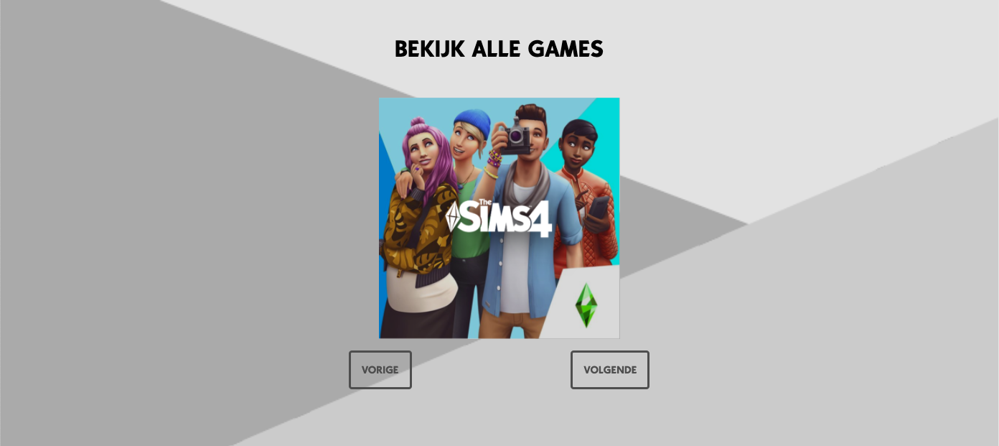
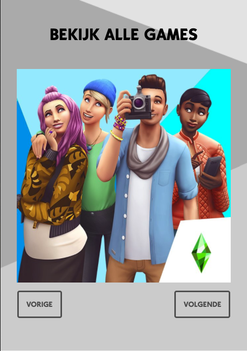
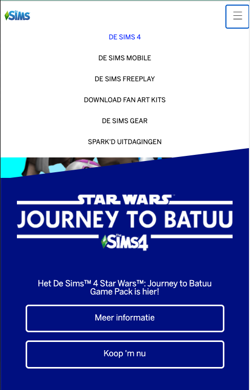

# Procesverslag
**Auteur:** -Nadja Gherasim-

Markdown cheat cheet: [Hulp bij het schrijven van Markdown](https://github.com/adam-p/markdown-here/wiki/Markdown-Cheatsheet). Nb. de standaardstructuur en de spartaanse opmaak zijn helemaal prima. Het gaat om de inhoud van je procesverslag. Besteedt de tijd voor pracht en praal aan je website.

## Bronnenlijst
1.  https://netspecialist.nl/html-en-css/523-driehoeken-maken-met-css 
2. https://www.ea.com/nl-nl/games/the-sims
3. https://codepen.io/shooft

## Eindgesprek (week 7/8)

-Alles ging uiteindlijk goed, het was evenm stressen met het stylen van de detail-pagina voor desktop, maar is uiteindlijk naaar heel veel kijken en probreren gelukt. Waar ik moeite mee had is dat het niet perfect kon, maar dat is meer een mijn probleem, dat heb ik gelukklig uiteindelijk los gelaten. De officiele website is afgelopen week verranderd omdat er een nieuwe pack is aangekondigd.-

**Screenshot(s):**

## Voortgang 3 (week 6)

### Stand van zaken

- De website is enigsinds responsive. Er zijn heel veel elementen waardoor het heel veel werk is om het mooi responsive te maken. Er is een gif aan de detail-pagina teogevoegd om interessanter te maken. Meeste linkjes en knoppen hebben een acftive state. Alle alt-teksten zijn geschreven.-

**Screenshot(s):**

### Agenda voor meeting

-Problemen met img bij schalen. Tips voor een alttekst bij afbeeldingen? Eerste 2 img naast elkaar krijgen op desktop. Originele sims website gebruikt 20 verschillende achtergonden voor resposive, ik heb een img gebuikt en die gestyled,  resposive schalen wordt daarom lastig Er zijn veel elementen op de website waardoor het responsive maken lastig is. -

### Verslag van meeting

-  Section een hight geven met VH
-  Align items in de tweede section
-  Knop een height geven
-  Formulier grid
-  Section moet een heading bevatten
-  Kortom voor ophoiging gaan

## Voortgang 2 (week 5)

### Stand van zaken

-Allebei de mobile pagina's hebben alle content en zijn zo goed als af. Er zitten verschillende animaties in verwerkt. Een werkende carrousel. Minimum gebruik van classes, alleen wanneer het echt noodzakelijk was.  -

**Screenshot(s):**

### Agenda voor meeting

-Moet de menu in een kruisje veranderen. Mag er extra pagina toegevoegd worden aan het menu. Is de gebruik van classes goed. Voldoende animaties-

### Verslag van meeting
- Alt text van je img invullen 
- class aan header in plaats van de nav
- In css de background img veranderen van de button
- Grid op form
- Width van 50% aan formulier en tekst
- Aparte functie waarde uitlezen van een dropdown
- Is de detail pagina goed
- Misschien elementen toevoegen aan de detail pagina
- Goed op weg, goed volgens planning

## Voortgang 1 (week 3)

### Stand van zaken

-Positionering, flexbox in het menu ging goed, ook het niet gebruiken van classes is gelukt, alleen wel heel erg veel code in de css dan. -

**Screenshot(s):**

### Agenda voor meeting

-Waarom wel of geen class gebruiken ipv nth-type? Foutmeldingen in javascript. Veranderen van burger menu naar kruis. Vragen over microinteracties: hamburger menu, inzoomen van afbeelding met css? Foto's laten overlappen met positioning of iets anders? Hoe krijg je afbeeldingen in de read me bestand. Sims website schuine blok onder afbeelding. Animatie bij menu Sims website. kleur hover op foto. Pagination.-

### Verslag van meeting

-
- Svg in html zetten zonder 
-  ![] (img..) syntax read me voor iedere afbeelding zetten.
-Regel uit inleiding programmeren bovenaan de JS tegen de error, of voor errors in console checken.
-  De nav niet op display:none doen, maar buiten de vh zetten en dan naar beneden laten komen met de klik functie en transition.
-  Pagination met javascript een carrousel maken voor de games. Denk aan dobbelsteen opdracht.
-  Een z-index op de menu zetten, zodat ie altijd vooraan staat.
-  Voor pagination mag class gebruiken, als het leven te zwaar wordt.
-  Goed op weg. De Wims website begint er op te lijken.-

## Intake (week 1)

**Je startniveau:** -blauw-

**Je focus:** -1b. Responsive website-

**Je opdracht:**-https://www.ea.com/games/the-sims
Ik heb voor deze site gekozen, omdat ik een grote fan ben van de Sims en er recent een STAR WARS Pack is aangekondigd waardoor het mij leuk leek om er juist nu voor te gaan kiezen. -

**Screenshot(s):** ![laptop] (images/screenshot-laptop); 

**Breakdown-schets(en):**

